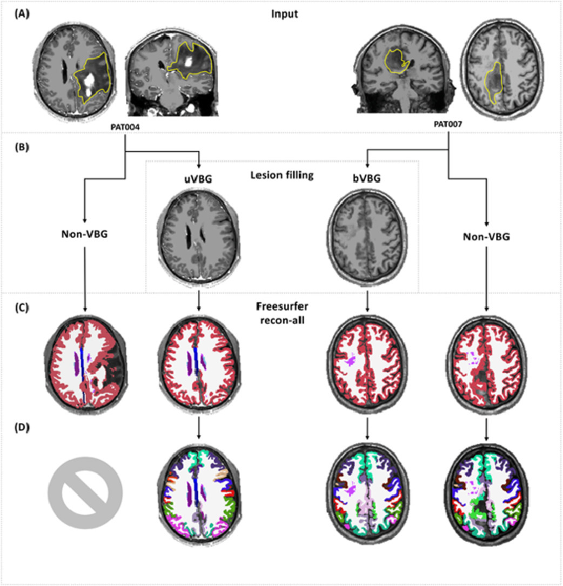
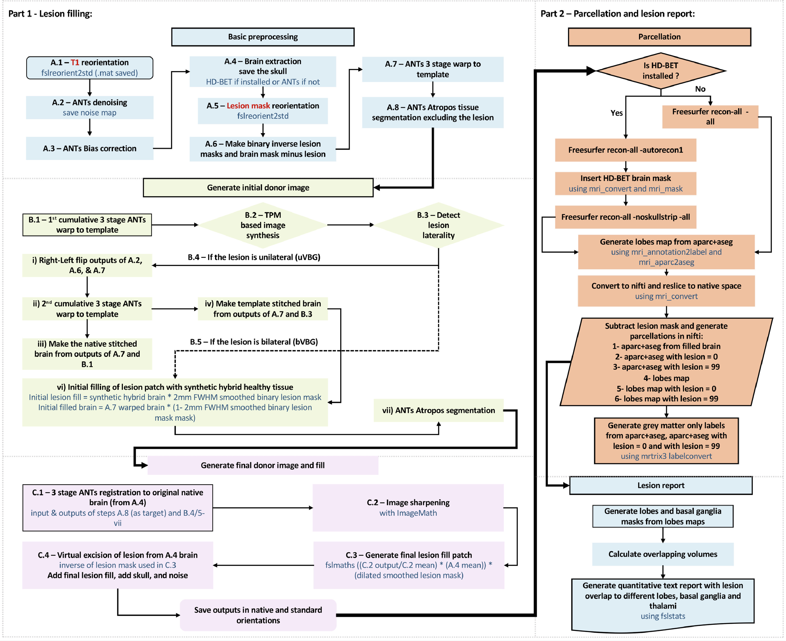

# KUL_VBG

KUL_VBG or "KULeuven - Virtual brain grafting" enables whole brain parcellation in the presence of large lesions.

Whole brain parcellation means labeling the brain in parts, gyri, etc...
Many parcellation software packages fail in the presence of large brain lesions.

The approach taken here is to:

- Extract the gross brain lesion using a mask
- Replace the brain lesion with normal looking tissue (hence virtual brain grafting)
- Run parellation software like freesufer &/or fastsurfer (which only work well on non-lesioned brains)
- Reinsert the lesion mask into the parcellation 

## Introduction 

For reference we point to the paper published in Neuroimage, 2021 available here: https://doi.org/10.1016/j.neuroimage.2021.117731

**** We recommend you to use the "master" branch of this repository, which is the updated and more stable version of KUL_VBG. For the version corresponding to the published article, please see the branch "Orig_doi.org/10.1016/j.neuroimage.2021.117731" ****

## Posing the problem and solution

An image to explain the problem: Freesurfer will not parcellate these brains



The graphical solution of the VBG workflow is shown here:




## Using VBG

VBG was tested in Mac OSX, WSL2 on WIN11, Ubuntu 18.0, 20.04, Mint 20, 21, and CentOS. 

VBG can be installed locally after installing the dependencies listed below.

Alternatively, use the container images — see **Using VBG via Docker or
Apptainer** below. Apptainer in particular needs no root at all, which makes it
the practical option on a shared/HPC server.

**Dependencies for installing VBG locally (v2.0):**

a) FreeSurfer **>= 7.3** (validated on 8.2.0) — required, not optional. VBG 2.0
   uses `mri_synthstrip` for brain extraction (`-B 1`), `mri_synthseg` (`-P 4`),
   and `segment_subregions` / `mri_segment_hypothalamic_subunits` for the
   multi-atlas block (`-M`). None of these exist in FreeSurfer 6.

b) ANTs v2.4.4 and the ANTsX scripts

c) FSL v6.0.7 (only `fslmaths`, `fslstats`, `fslreorient2std`, `fslswapdim`,
   `fslorient` and `imcp` are actually used)

d) MRtrix3 v3.0.4+ (command-line tools only; `mrview` is not needed)

e) FastSurfer — only required for `-P 2` / `-P 3`

f) Python 3 with `numpy`, `scipy`, `nibabel`, `matplotlib` (for `KUL_VBG_QC.py`
   and `KUL_lesion_overlap.py`)

> **Note:** HD-BET is no longer a dependency. VBG 2.0 replaced both HD-BET code
> paths with SynthStrip (`-B 1`, default) and ANTs-BET (`-B 2`).

** Check (https://github.com/treanus/KUL_Linux_Installation.git) for help with setting up your environment with different neuroimaging packages.

## Examples

Inputs:

Obligatory: 
1- Input to -S flag (subject/participant name in BIDS convetion, without the leading sub-). 
2- A nifti format T1 WI of a subject (input to -a flag)
3- Binary lesion mask (lesion = 1, background = 0) integer nifti format (input to -l flag)
4- Indicate lesion mask space (input to -z flag) N.B. the specified lesion mask must have the same dimensions and transform as the input T1 WI.

Optional:
1- Specify location of intermediate processing and output folders (-m and -o flags)
2- Specify number of parallel workers used (input to -n flag)
3- Specify type of filling (default = uVBG, to activate bVBG use the -t flag)
4- Specify age group of participant (default = adult, to activate pediatric friendly mode specify the -p flag)
5- To run parcellation specify the after the lesion filling is finished, specify the -P flag with input 1=Freesurfer, 2=FastSurfer, 3=FastSurfer/FreeSurfer hybrid
6- Verbose mode = -v

Examples:

    - Using the unilateral VBG approach and HD-BET for brain extraction, input data is in BIDS format with only 1 session, using FreeSurfer for parcellation
    KUL_VBG.sh -p pat001 -b -n 6 -l /fullpath/lesion_T1w.nii.gz -z T1 -o /fullpath/output -B 1 -P 1 -v
    
    - Using the bilateral VBG approach and HD-BET for brain extraction, input data is not in BIDS, using FastSurfer for parcellation
    KUL_VBG.sh -p pat001 -a /fullpath/sub-PT_T1w.nii.gz -n 6 -l /fullpath/lesion_T1w.nii.gz -z T1 -o /fullpath/output -t -B 1 -P 2 -v
	

Purpose:

    The purpose of this workflow is to generate a lesion filled image, with healthy looking synthetic tissue in place of the lesion
    Essentially excising the lesion and grafting over the resulting defect in the T1 MR image space.
    

Required arguments:

    -S:  BIDS participant name (anonymised name of the subject without the "sub-" prefix)
    -b:  if data is in BIDS
    -l:  full path and file name to lesion mask file per session
    -z:  space of the lesion mask used (only T1 supported in this version)
    -a:  Input precontrast T1WIs

Optional arguments:

    -s:  session (of the participant)
    -t:  Use the VBG template to derive the fill patch (if used, template tissue is used alongside native tissue to create the donor brain)
    -E:  Treat as an extra-axial lesion (skip VBG bulk, fill lesion patch with 0s, run FS and subsequent steps)
    -B:  specify brain extraction method (1 = HD-BET, 2 = ANTs-BET), if not set ANTs-BET will be used by default
    -P:  Run parcellation (1 = FreeSurfer recon-all, 2 = FastSurfer)
    -p:  In case of pediatric patients - use pediatric template (NKI_under_10 in MNI)
    -m:  full path to intermediate output dir (if not set reverts to default output ./VBG_out/proc_VBG)
    -o:  full path to output dir (if not set reverts to default output ./VBG_out/output_VBG)
    -n:  number of cpu for parallelisation (default is 6)
    -v:  show output from mrtrix commands
    -h:  prints help menu

Notes: 

    - Input flags -b and -a are mutually exclusive, if your data is in BIDS use -b, and if not then specify exact path and name for the patient's T1.nii.gz 
    - You need a high resolution T1 WI and a lesion mask in the same space for VBG to run
    - If you end up with an empty image, it is possible you have a mismatch between the T1 and lesion mask
    - The lesion mask can be generated with any lesion segmentation tool.
    - The lesion mask needs to specific to the lesion with voxel values=1 encoding the lesion and 0 for the healthy tissue.

Installation instructions:

    - Clone this repository, add the installation directory to your path in Bash shell.
    - Ensure that all dependencies are met, FastSurfer is only required if you will use it for parcellation (i.e. with -P 2 or -P 3)

## Using VBG via Docker or Apptainer

Container images bundle FreeSurfer 8.2.0, FSL, ANTs, MRtrix3, FastSurfer and
VBG itself, so there is nothing to install beyond the container runtime.

Full documentation, build instructions and troubleshooting are in
[`Docker/README.md`](Docker/README.md).

**You must supply your own FreeSurfer license.** It is deliberately not included
in the image — the license is issued per user and cannot be redistributed.
Register for free at <https://surfer.nmr.mgh.harvard.edu/registration.html>,
then bind it in at `/licence/license.txt` as shown below.

### Apptainer (no root required — use this on a shared or HPC server)

```bash
apptainer run --nv \
    -B /path/to/license.txt:/licence/license.txt \
    -B "$PWD":/data \
    KUL_VBG_2.0.sif \
    KUL_VBG.sh -S PAT001 -a /data/sub-PAT001_T1w.nii.gz \
               -l /data/lesion.nii.gz -z T1 \
               -o /data/VBG_out -B 1 -P 1 -n 8 -v
```

### Docker

```bash
docker run --gpus all --rm -it \
    -v /path/to/license.txt:/licence/license.txt:ro \
    -v "$PWD":/data \
    kul_vbg:2.0 \
    KUL_VBG.sh -S PAT001 -a /data/sub-PAT001_T1w.nii.gz \
               -l /data/lesion.nii.gz -z T1 \
               -o /data/VBG_out -B 1 -P 1 -n 8 -v
```

Drop `--nv` / `--gpus all` if there is no GPU — everything still works, and only
FastSurfer (`-P 2`/`-P 3`) is slower.

Note that all paths passed to `KUL_VBG.sh` must be paths **inside** the
container (`/data/...`), not host paths.

### Building the images

```bash
cd Docker
./build.sh --sif     # builds the Docker image, then converts it to a .sif
```

The resulting `.sif` is a single self-contained file: copy it to the server and
run it there, no root and no installation required.


